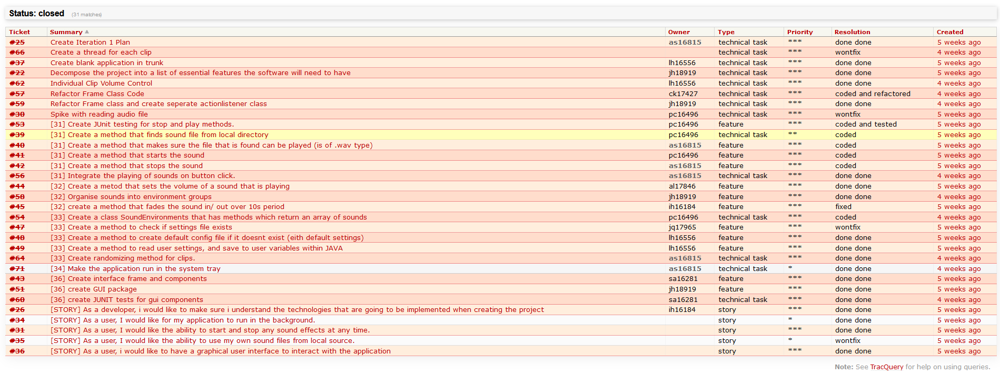
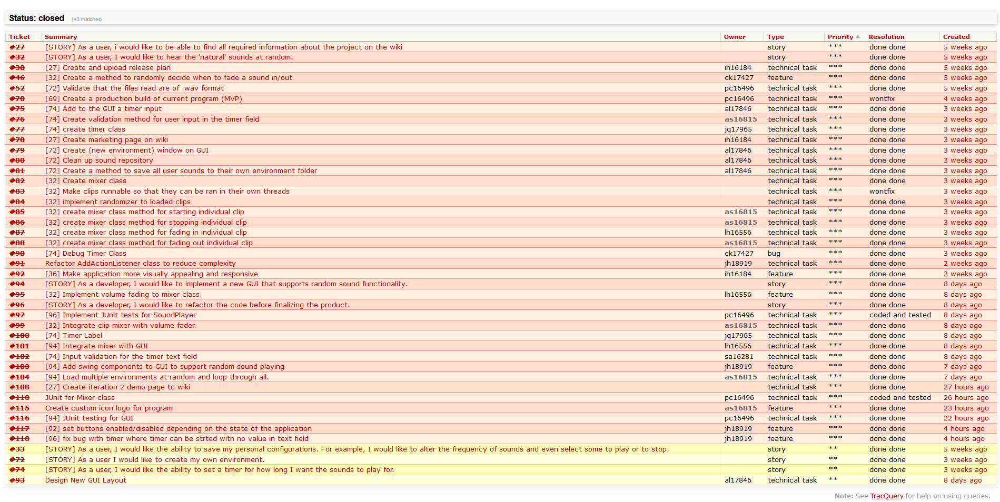

# Sound Scape Generator
### Description
A Java collaborative project. This program allows the user to play ambient background sounds at random or at command. Full user interface is implemented and provides all functionality requested by the project client. Project management done in Trac.

### Unit Testing
JUnit4 is used for unit testing. To prevent it from running, simply select Test package and mark directory as Excluded.

### Team Members
- **Alex Sikorski** (as16815)
- **Paris Chrysanthou** (pc16496)
- **James Henderson** (jh18919)
- **Louis Holdsworth** (lh16556)
- **Jordan Quartey** (jh18919)
- **Ibukun Hassan** (ih16184)
- **Saif Alshamsi** (sa16281)
- **Anna Lorek** (al17846)
- **Callum Kleber** (ck17427)

### Project Description (in Trac)
Naturescape: Natural Soundscapes to the Desktop

The Project: Students and staff of the university (and elsewhere) experience significant levels of stress in their daily activities. Research shows that being exposed to a natural environment even if only for a short while rapidly relieves from stress and mental fatigue. While it is difficult to get exposure to nature while working in a lab, in an office or in your flat, there is evidence that listening to natural sounds on its own provides similar benefits.

In this project you will produce a program that brings natural sounds to people’s desktops via a highly-customisable soundscape generator. The program will continuously generate sounds, obtained by mixing natural sounds (such as bird singing sounds, rain and water noises, wind, waves on a beach, etc.) in a pseudo-random, pleasing manner If the project is successful, it will be used by many people around the University and beyond. 

### Requirements (in Trac)
**Functional Requirements**
- Ability to start / stop sounds. (highest)
- Play natural sounds randomly (highest)
- Save user configuration. (medium)
- Application runs in the background. (low)
- Load sound files from a local source. (low)

**Non-functional Requirements**
- The language used for this project is Java, with the GUI being built with the Java Swing Framework. 
- The IDE we are using is IntelliJ IDEA.
- Preset configuration (e.g. beach, forest, etc...) or create a custom config. (medium-high)
- User can configure their preferred sounds and their respective volumes.
- How often and how loud the sound is played. (medium)
- Ability to upload own sounds. (low)
- Option to run program on boot. (low but easy)
- Set timer on playback, could fade out (low)
- Ability to process sound file once (less processing required e.g. export) (not priority, could do if we have time)

**Iteration 2 Requirements**
- Start randomising how often sounds are played (High)
- User made environment (Medium)
- Set timer on playback, could fade out 

**Constraints**
Iteration 1 due **18th November 2019: 2pm.**
Iteration 2 due **10th December 2019: 2pm.**

### Tickets for Iteration 1 (in Trac)

### Tickets for Iteration 2 (in Trac)

### Group Results
n/a (not released)

### Personal Result
n/a (not released)
